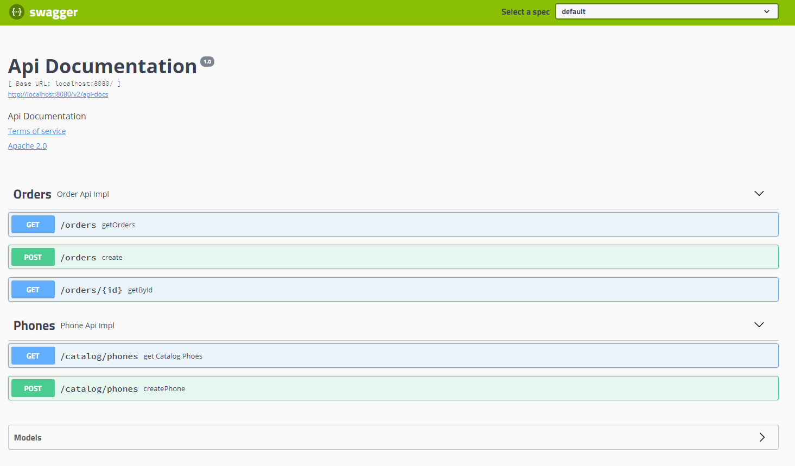

# Mas Movil Code Challenge

Code Challenge – Backend Developer
Autor: Jose A. Luceño Castilla

## Compile

To compile the project, use maven with the following command:

```bash
mvn clean package 
```

## Run environment Docker 

After compiling the project we can build a docker environment that consists of the api and
from the a mongodb database.

To raise the environment we use the command:

```bash
docker-compone up --build
```

To stop and destroy the created containers:

```bash
docker-compone down
```


## API Documentation

The api is documented with swagger, we can access the swagger-ui at the URL:

[Swagger](http://localhost:8080/swagger-ui.html)




## License
[MIT](https://choosealicense.com/licenses/mit/)